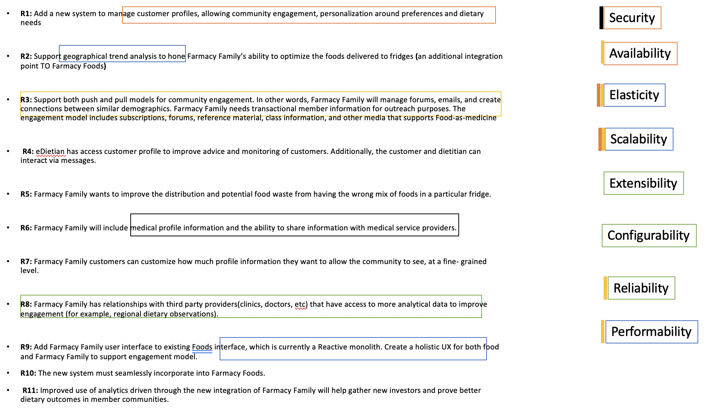

## Quality Attributes Scenarios

Lets start by mapping architecture characteristics (we also referred them as architecture illities or non functional requirements) and see what type of characteristics we could extract out from the core system requirements.

#### **Business Requirements(leftside) <---> Quality Attributes(rightside)**

## *Security*
- User personal data must be protected via encryption in all communication channels. 
- User personal data must be protected via encryption or access control wherever it is stored or manipulated. 
- User medical data needs to be HIPA Complaint.
- User medical data needs to be secured to avoid any potential hacker attacks.

## *Availability*
- The system must be highkly available to fullfill on going customer needsd and available to integrate with other 3rd party systems like Clinic/eDietian as well as farmacy Foods.

## *Scalability*
- The system must quickly and automatically cater to an increasing number of users.
- As users can join from different geographical locations so at any difficult to pin point from where the next batch of load gets trigerred. 

## *Elasticity*
- Scalability is required for elasticity, but not the other way around.
- The system must quickly and automatically cater to a bust in the incoming requests.
- There are Onine wellness education classes, workshops etc. happening where bursts of users might show up so platform needs to support that as core requirement and better to scale up/out more resources, as needed.

## *Extensibility*
- The level of extensibility reflects how easy it is to extend or enhance the software system. Software systems that are designed to be extensible take future growth into consideration by anticipating the need to add new functionality.
- It also enable our platform to quickly do experiments.
- There are different integration points to this system so it should be easily extendiable for any such future needs (new integration point, new engagement model etc.)

## Performance
- #### *Response time*
    - Customer engaged in different forums or live ongoing welness education classes are few examples where quick response time is very critical. Stream capability specially needs to account for better bandwidth that helps getting responses within agreed upon time limits.
    - Customer interactions must complete timely (within defined SLA, TP99 <700ms for most critical operartions) to provide a smoother customer experience.
    - All non-customer interactions should be responsive enough to support operations, but it’s acceptable to be less responsive than the user/customer interactions.
- #### *Throughput* 
    - During peak hours, the system must be able to support a high number of concurrent user sessions (e.g., 200 simultaneous users). 

## *App usability* 
- The different versions of the app should provide a user experience that appeals to the target user population. 
- Using UX design techniques, and providing high levels of customization are goals.
- AT the end of the day, it should be a seamless experience for Farmacy Foods and Family customers.

Along with this there are some other characteristics that we should in general keep in mind and nopt calling out as they are cionsidered implicit for this system perspective.

### Fault Tolerance
Farmacy family is a system on which customers going to rely so it should have builtin ability to continue operating despite failures or malfunctions. Should rely on better cloud technologies tyhat make this easy for distributed systems.

### Configurability
Farmacy family as well as other integrated system should be easily configurable to adjust business needds and demands. For example, Notification system should allow differernt sort of channel like email, SMS, PUSH type notifications if the need be.

### Reliability
Farmacy Family system deals with customer as well as customer medical data and provide different types of collaboration and edutional means as well as provide analytics that customer heavily rely on hence system should be realiable with its provided services and make sure that there is stability and consistency in the recommendation they suggest and services they provide.
